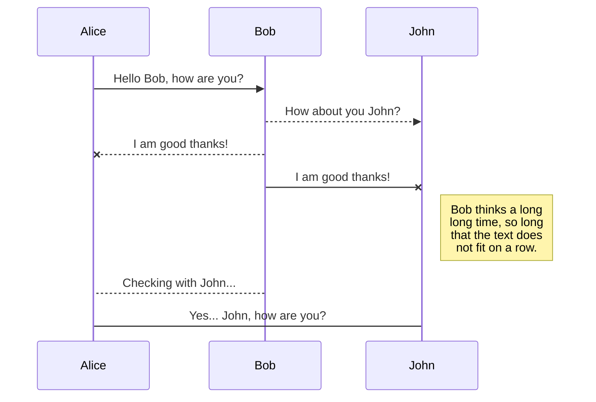

# Ejercicios Progración Orientada a Objetos (POO) en Python

En este repositorio se encuentran los ejercicios del curso de [POO con Python](https://platzi.com/clases/poo-python/) de platzi

## Decomposición
POO establece que debemos decomponer los objetos, los cuales tienen atributos, y metodos que representan el comportamiento del objeto.

La decomposición permite
* Partir un problema en problemas más pequeños
* Las clases permiten crear mayores abstracciones en forma de componentes
* Cada clase se encarga de una parte del problema y el programa se vuelve más fácil de mantener

